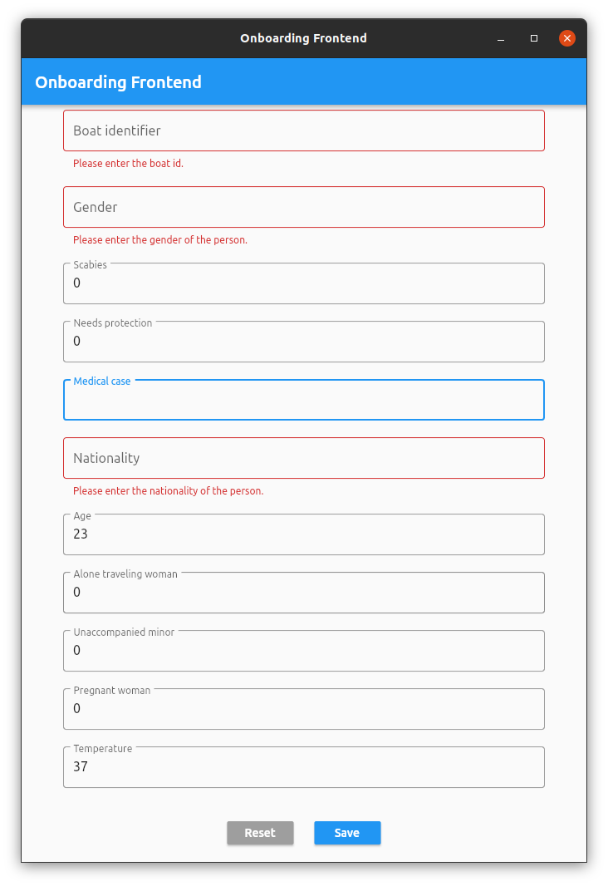

# Onboarding Frontend 
Onboarding Frontend is the User Interface for Android, iOS, Linux and the Web using:
1. **Dart**
2. **Flutter** 



## Installation (Ubuntu Desktop 20.04 LTS)
```bash
# Install Flutter
$ sudo snap install flutter --classic
# Initializing Flutter
$ flutter sdk-path

# Install OpenJDK
$ sudo apt install openjdk-8-jdk
# Set standard java 8
$ sudo update-alternatives --config java

# Setup Flutter
$ flutter doctor --android-licenses
$ flutter channel dev
$ flutter upgrade
$ flutter config --enable-linux-desktop
$ sudo snap install android-studio --classic
$ flutter config --android-studio-dir="/snap/android-studio/101/android-studio"
$ sudo snap install chromium chromium-ffmpeg
$ export CHROME_EXECUTABLE=/snap/bin/chromium
```

## Verify Flutter Setup
```bash
# Verify flutter setup and connected devices by running flutter doctor. 
$ flutter doctor -v
[✓] Flutter (Channel dev, 2.1.0-12.1.pre, on Linux, locale en_US.UTF-8)
    • Flutter version 2.1.0-12.1.pre at /home/user/snap/flutter/common/flutter
    • Framework revision 8264cb3e8a (4 weeks ago), 2021-03-10 12:37:57 -0800
    • Engine revision 711ab3fda0
    • Dart version 2.13.0 (build 2.13.0-116.0.dev)

[✓] Android toolchain - develop for Android devices (Android SDK version 30.0.3)
    • Android SDK at /home/user/Android/Sdk
    • Platform android-30, build-tools 30.0.3
    • Java binary at: /snap/android-studio/101/android-studio/jre/bin/java
    • Java version OpenJDK Runtime Environment (build 1.8.0_242-release-1644-b3-6222593)
    • All Android licenses accepted.

[✓] Chrome - develop for the web
    • CHROME_EXECUTABLE = /snap/bin/chromium

[✓] Linux toolchain - develop for Linux desktop
    • clang version 6.0.0-1ubuntu2 (tags/RELEASE_600/final)
    • cmake version 3.10.2
    • ninja version 1.8.2
    • pkg-config version 0.29.1

[✓] Android Studio
    • Android Studio at /snap/android-studio/101/android-studio
    • Flutter plugin can be installed from:
      🔨 https://plugins.jetbrains.com/plugin/9212-flutter
    • Dart plugin can be installed from:
      🔨 https://plugins.jetbrains.com/plugin/6351-dart
    • android-studio-dir = /snap/android-studio/101/android-studio
    • Java version OpenJDK Runtime Environment (build 1.8.0_242-release-1644-b3-6222593)

[✓] Connected device (2 available)
    • Linux (desktop) • linux  • linux-x64      • Linux
    • Chrome (web)    • chrome • web-javascript • Chromium 89.0.4389.114 snap

• No issues found!
```

## Edit the dart sources
```bash
# The primary sources are located under lib.
$ vi lib/main.dart 
```

## Build and run the app
```bash
# Build and execute the native linux app.
$ flutter build linux 
$ flutter run -d linux
# Execute the native linux app without debug mode.
$ ./build/linux/x64/release/bundle/onboarding-frontend
# Build and execute the web app.
$ flutter build web
$ CHROME_EXECUTABLE=/snap/bin/chromium flutter run -d chrome
# Build and execute the android app.
$ flutter build apk
$ flutter build appbundle
# Clean up the builds.
$ flutter clean
```
